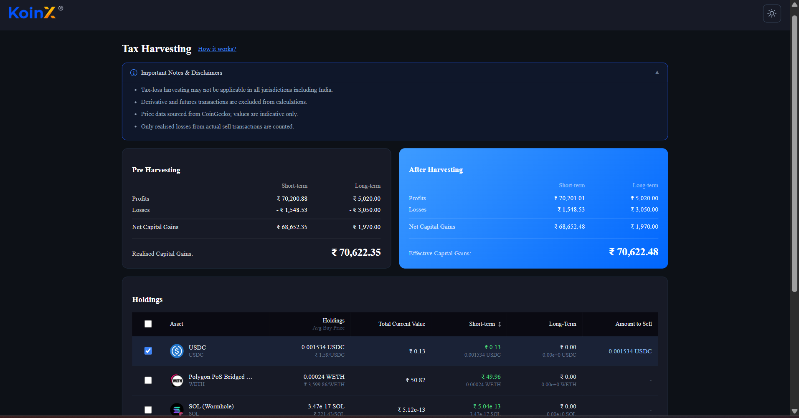
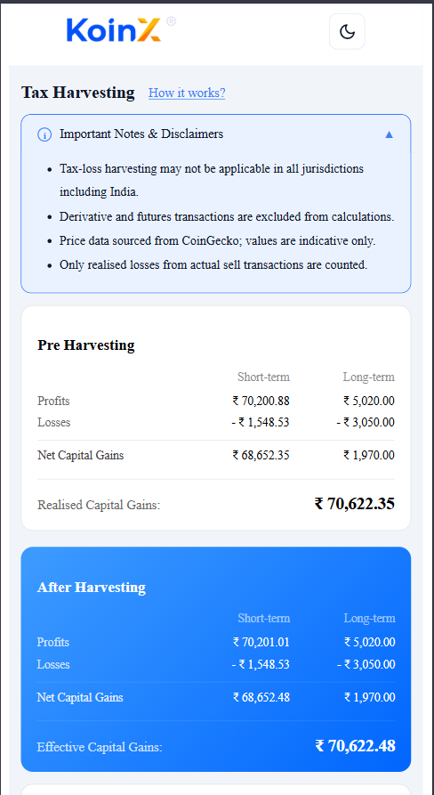
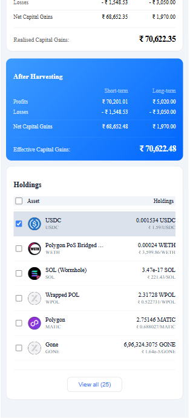
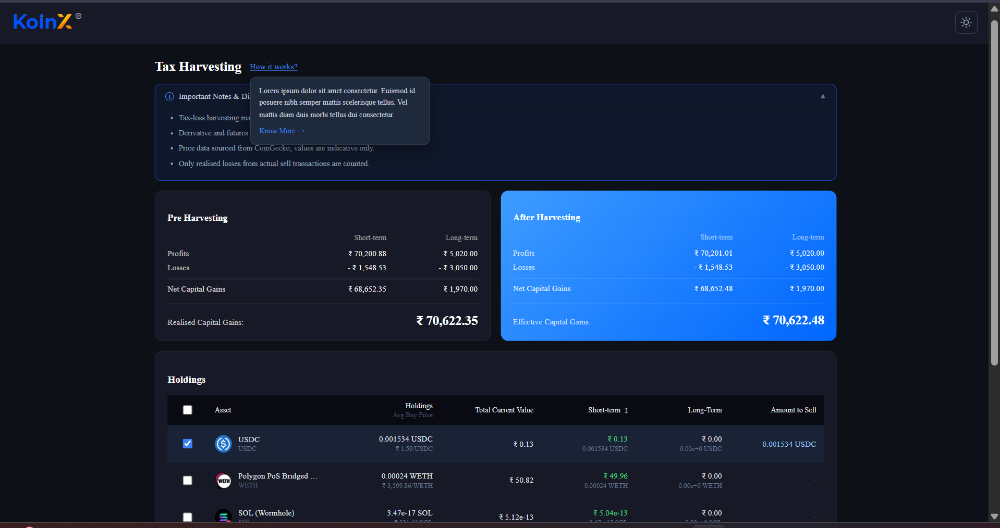

#  Tax Loss Harvesting Tool

A responsive React application that helps crypto investors visualize and optimize their tax liability through strategic loss harvesting.

---

## 📸 Screenshots

### Dashboard (Dark Mode)


### Dashboard (Light Mode)


### Mobile View


### How It Works Popup



---

## 📁 Folder Structure

```
tax-harvesting/
├── public/
│   ├── data/
│   │   ├── holdings.json
│   │   └── capitalGains.json
│   ├── icons.svg
│   └── KoinX.png
│
├── src/
│   ├── assets/
│   │   └── logo.png
│   │
│   ├── components/
│   │   ├── cards/
│   │   │   ├── PreHarvestCard.jsx
│   │   │   ├── AfterHarvestCard.jsx
│   │   │   └── Card.css
│   │   │
│   │   ├── table/
│   │   │   ├── HoldingsTable.jsx
│   │   │   └── Table.css
│   │   │
│   │   ├── Header.jsx
│   │   └── Header.css
│   │
│   ├── context/
│   │   ├── HarvestContext.jsx
│   │   └── ThemeContext.jsx
│   │
│   ├── pages/
│   │   ├── Dashboard.jsx
│   │   └── Dashboard.css
│   │
│   ├── services/
│   │   └── api.js
│   │
│   ├── utils/
│   │   └── calculations.js
│   │
│   ├── App.jsx
│   ├── App.css
│   ├── main.jsx
│   └── index.css
│
├── index.html
├── vite.config.js
├── package.json
└── README.md
```

---

##  How It Works

###  Mock APIs

Data is served as static JSON files from the `public/data/` directory, fetched via `fetch()` in `src/services/api.js`. No backend server is required.

| Endpoint                  | File                          | Description                              |
| ------------------------- | ----------------------------- | ---------------------------------------- |
| `/data/holdings.json`     | public/data/holdings.json     | All crypto holdings with STCG/LTCG gains |
| `/data/capitalGains.json` | public/data/capitalGains.json | Baseline pre-harvesting capital gains    |

---

###  Tax Loss Harvesting Logic

* **Pre-Harvesting Card** shows capital gains directly from the Capital Gains API
* **Holdings Table** lists all assets with selectable checkboxes
* **After Harvesting Card** updates dynamically:

  * If gain is **positive** → added to **Profits**
  * If gain is **negative** → added to **Losses**

---

###  Key Calculations

```
Net Capital Gains = Profits − Losses
Realised Gains    = Net STCG + Net LTCG
Savings           = Pre-Harvesting Total − Post-Harvesting Total (if > 0)
```

A **"You're going to save ₹X"** banner appears when post-harvesting gains are lower than pre-harvesting gains.

---

## ✨ Features

*  Real-time updates — After Harvesting card reacts instantly
*  Select All / Deselect All — Bulk selection support
*  Sortable STCG column — Ascending / descending toggle
*  View All / View Less — Expandable table view
*  Dark / Light theme — Toggle via header
*  Savings banner — Appears conditionally
*  Mobile responsive — Optimized for small screens
*  Loading & error states — During API fetch
*  Coin logo fallback — Shows initials if image fails

---

##  Tech Stack

| Tool              | Purpose                 |
| ----------------- | ----------------------- |
| React 18          | UI framework            |
| Vite              | Build tool & dev server |
| React Context API | Global state management |
| Vanilla CSS       | Styling                 |

---

## 📝 Assumptions

*  Currency: All values are in Indian Rupees (₹) using `en-IN` formatting
*  Mock API: Uses static JSON instead of real backend
*  Duplicate coins: Treated as distinct assets based on `coin + coinName`
*  Amount to Sell: Entire holding is assumed sold when selected
*  Gains calculation: Based only on `stcg.gain` and `ltcg.gain`
*  Savings display: Only shown when post-harvesting gains are **strictly lower**
*  Theme persistence: Stored in React state (resets on refresh)
*  Tiny values: Displayed in scientific notation to avoid rounding errors

